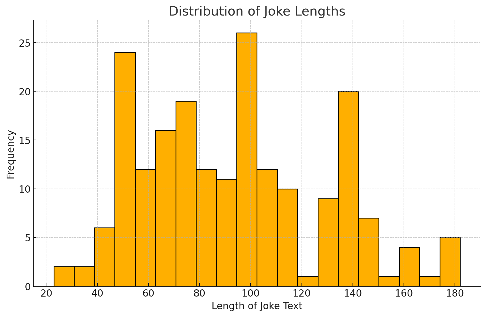
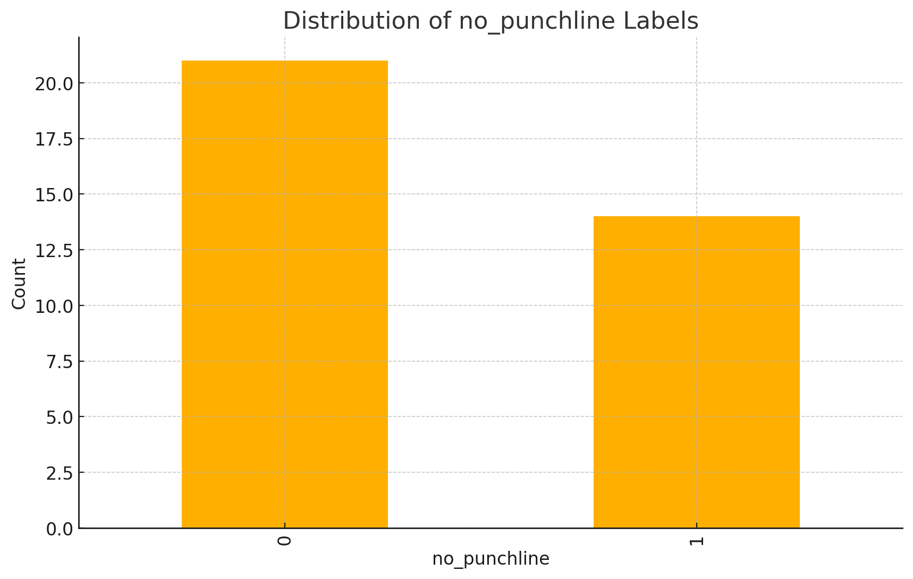
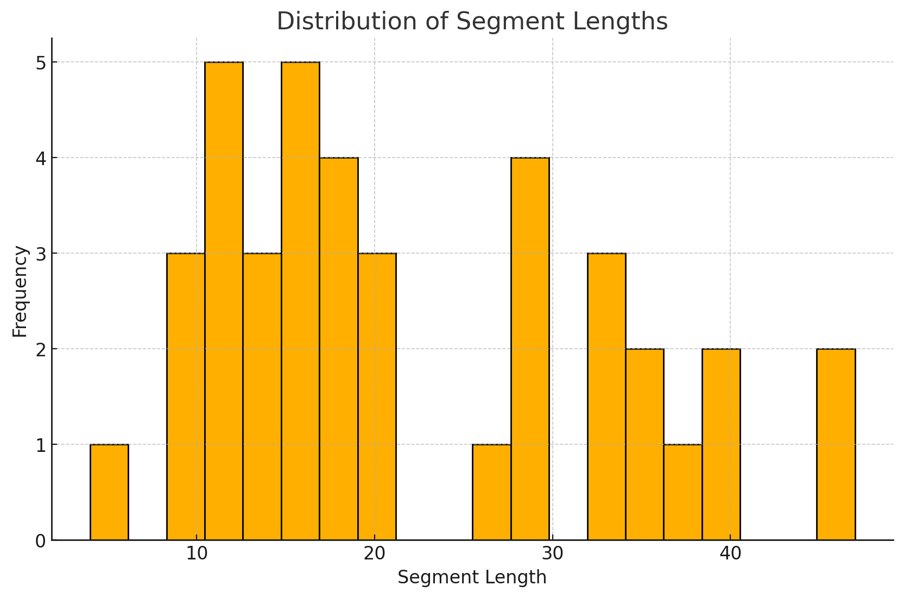

# Short Jokes Punchline Labler

## Executive Summary
This project is a joke labeling application designed to collect and analyze user-generated labels for jokes. The motivation behind this project is to understand humor patterns and preferences by analyzing labeled jokes. Potential applications include improving joke recommendation systems, creating humor-based content, and conducting research on humor perception.

---

## Description of Data

The dataset consists of jokes and their associated labels, stored in CSV files:

- **`joke.csv`**: Contains jokes with the following columns:
  - **`id`**: Unique identifier for the joke.
  - **`text`**: The content of the joke.
  - **`created_at`**: Timestamp when the joke was created.

- **`label.csv`**: Contains labels with the following columns:
  - **`id`**: Unique identifier for the label.
  - **`joke_id`**: Foreign key referencing the joke being labeled.
  - **`visitor_id`**: Foreign key referencing the visitor who labeled the joke.
  - **`no_punchline`**: Indicates whether the joke has no punchline (`1` for true, `0` for false).
  - **`created_at`**: Timestamp when the label was created.

- **`label_segment.csv`**: Contains labeled segments with the following columns:
  - **`id`**: Unique identifier for the labeled segment.
  - **`label_id`**: Foreign key referencing the label.
  - **`start_index`**: Starting index of the labeled segment.
  - **`end_index`**: Ending index of the labeled segment.

- **`visitor.csv`**: Contains visitor information with the following columns:
  - **`id`**: Unique identifier for the visitor.
  - **`created_at`**: Timestamp when the visitor was created.

---

## Power Analysis Results
The power analysis results indicate that this dataset should collect 64 labels for the same jokes. However, given the limited amount of time available, this may be infeasible. Therefore, in the implementation of this web app, I will prioritize labeling jokes with fewer labels, allowing for a greater variety of jokes to be included.

---

## Exploratory Data Analysis (EDA)

The Joke Labeling Dataset underwent a thorough Exploratory Data Analysis to uncover key statistics, trends, and distributions across its four components: `joke.csv`, `label.csv`, `label_segment.csv`, and `visitor.csv`. Below is a summary of the findings:

---

### **1. Joke Text Analysis**
- **Text Length Statistics**:
  - Average joke length: **93.5 characters**
  - Minimum joke length: **23 characters**
  - Maximum joke length: **182 characters**

  
*The histogram above illustrates the distribution of joke lengths.*

- **Word Frequency**:
  - **Most Common Words**: "did", "like", "say", "don", "just"
  - **Least Common Words**: "yoko", "yoda", "yes", "years", "yeah"

---

### **2. Label Analysis**
- **Total Labels**: **35**
- **Average Labels Per Joke**: **~1.03**
- **Joke with the Most Labels**:
  - **Joke ID**: `1`
  - **Label Count**: `2`
- **Joke with the Least Labels**:
  - **Joke ID**: `2`
  - **Label Count**: `1`

  
*The bar chart above shows the distribution of `no_punchline` labels.*

---

### **3. Label Segment Analysis**
- **Proportion of Jokes with Labeled Segments**: **~10.5%**
- **Segment Length Distribution**:  
  Segment lengths vary widely, as shown in the histogram below.

---

This analysis offers valuable insights into the structure and content of the dataset. It shows that a large percentage of the labels are marked as 'no_punchline.' This may indicate a barrier in background knowledge that affects the understanding of the jokes. Collecting more diverse data could help clarify the relationships present in the dataset.

---

## Link to Data Sourcing Code Repository
The code for sourcing and processing the data is publicly available at [GitHub Repository](https://github.com/your-repo/joke-labeling).

---

## Ethics Statement
This project aims to study humor while being mindful of ethical considerations. Efforts have been made to filter out offensive content, but some jokes may still be inappropriate. Users are encouraged to report any offensive jokes. The data collected is anonymized to protect user privacy.

---

## Open Source License
This project is licensed under the MIT License. See the LICENSE file for more details.
